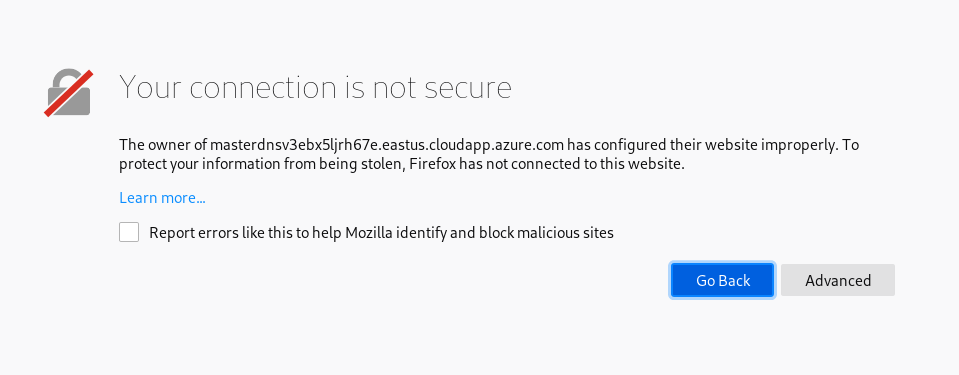
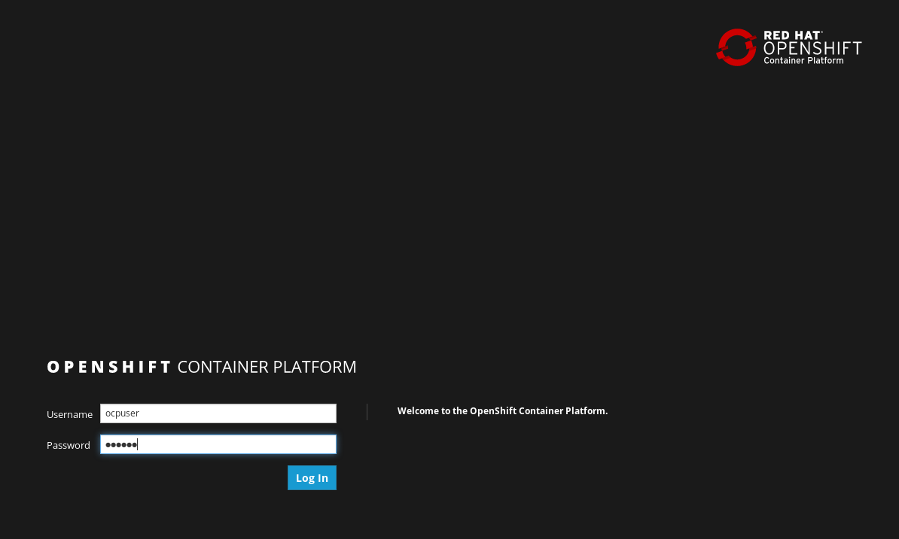

Objectives and pre-requisites
=============================

This document describes the introductory steps how to work with OpenShift Container Platform and its
BuildConfig and OpenShift pipelines. The purpose is to show how OpenShift extends Kubernetes.

The lab is based on OpenShift version 3.10.

You need to have an account on [GitHub](http://www.github.com/), If
you don't have one create a free account (<https://github.com/>).

The Lab challenges cover:

-   Introduction to OpenShift

-   Creating and managing OpenShift project

Introduction to openshift
=========================

[OpenShift](http://www.openshift.com) containers platform is Red Hat's Platform-as-a-Service (PaaS) on top of Kubernetes. 
It allows developers to quickly develop, host, and scale applications in a cloud environment and have Enterprise ready Kubernetes distribution.

Microsoft and Red Hat have signed a partnership that includes support to run Red Hat OpenShift on Microsoft Azure and Azure Stack. That will be 
expanded to fully managed solution soon.

OpenShift offers multiple access modes including: developer CLI, admin CLI, web console and IDE plugins. Click2cloud is a plugin that allows Visual studio to deploy code to OpenShift, directly.

CHALLENGE 1: Create and manage projects 
=========================================

First we will learn how to create a project(namespace in Kubernetes). In  this challenge we will focus on the graphical portal.

To create an *application*, you must first create a new *project*, which will contain the application.

1.  From your browser, visit the OpenShift web console at *https://<MASTER_IP>:8443*. The web site, uses a self-signed certificate,
so if prompted, continue and ignore the browser warning.

2.  Log in using your username and password.

 

3.  To create a new project, click on blue *Create Project* button.

2.  Type a *unique* name, display name, and description for the new project.

5.  Click Create. The web console's welcome screen should start loading.

6.  Click on the project name in right column and examine your fresh project.

