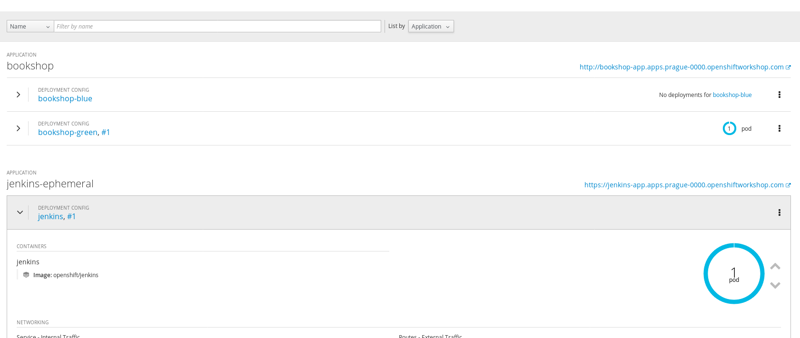
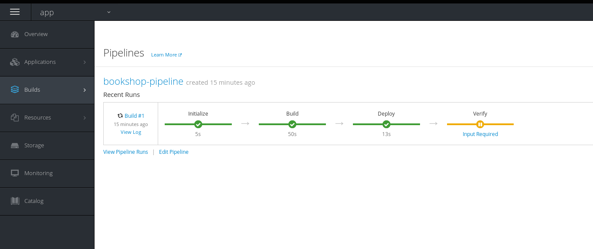
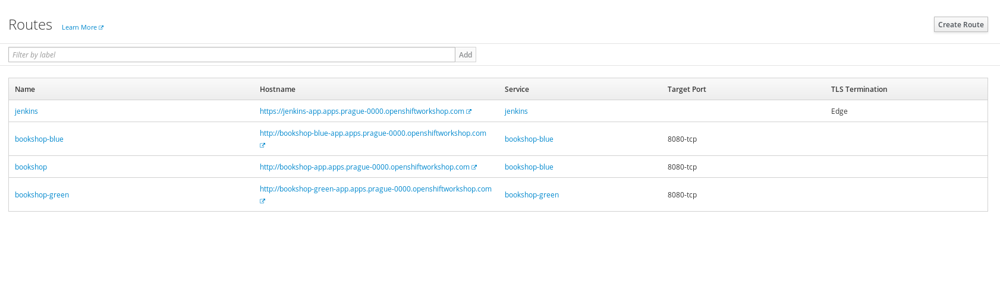
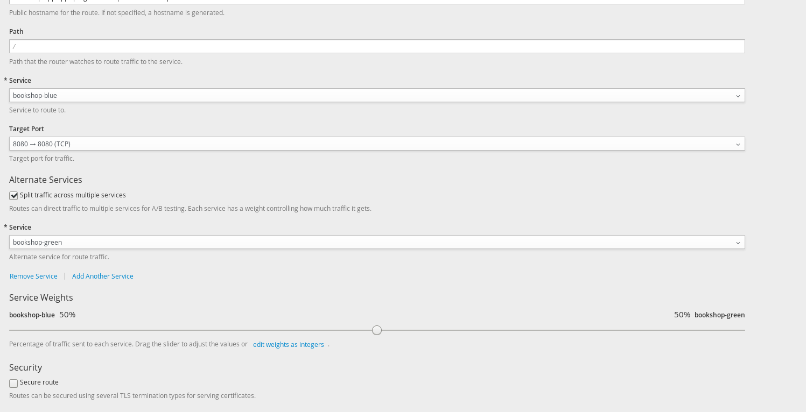

CI/CD with blue green deployment
==========================================

In this lab we are going to deploy 2 custom made applications on OpenShift:

- bookshop - its just random frontend app
- bookreview - serves review data to bookshop

We will show you how to deploy these application on OpenShift, how to use Jenkins
to achieve continuous integration and continuous delivery of these application
on OpenShift.

Finally we will show you how to achieve deployment stability via Blue/Green
deployment. Blue/Green deployment is a technique to address the challenges
of continuous deployment like a minimizing downtime during new version enrollment.
It also enables you to quickly rollback any changes as it is based about the idea
of having two identical environment called "blue" and "green" and switching
between them

Deploying bookreview application
===================================
This chapter is a short review what did you learned in previous workshop. 
Use the steps from previous workshop but now deploy *bookreview* application 
from bookreview direcotry.

*Note* - you must name the application *bookreview* excatly

Deployin bookshop application via Pipeline
===================================

Now we will deploy Bookshop application As we mentioned above, we will need to deploy this service to two environments.
We need to deploy DeploymentConfig, service and a Route.

To deploy a blue one, run:
``` bash
oc process -f openshift/bookshop.yaml COLOR=blue | oc apply -f -
```

To deploy a green one, run:
``` bash
oc process -f openshift/bookshop.yaml COLOR=green | oc apply -f -
```

Finally we need to deploy our pipeline, which is responsible for deploying our
application and switching master route. To do it, please eddit line 20 in the yaml
file to contain URL of your fork.

``` bash
oc process -f openshift/bookshop.pipeline.yaml | oc apply -f -
```

You can see whats happening in the cluster by invoking:
``` bash
oc get all
```

Alternatively, you can use OpenShift web console to examine deployed resources.

*Tasks:*

- Use cat and compare template definition with objects defined in corresponding OpenShift Projects
- Login to Jenkins a look at the defined pipeline

Now you can go to OpenShift Console and look inside build->pipelines. Then you should be 
able to see the builds.



You should review the pipeline and see if the app is deployed.



Modify bookshop application in a similar way as in previous workshop and run the build manualy
Before acknowledging changes in the pipeline please review blue, green and master router.



Now when you know how blue green deployment is working. Please patch the master route manualy.




*Tasks:*
- Update the pipeline definition with the github triggering and show its working
- Create blue/green pipeline deployment for *bookreview* application too
